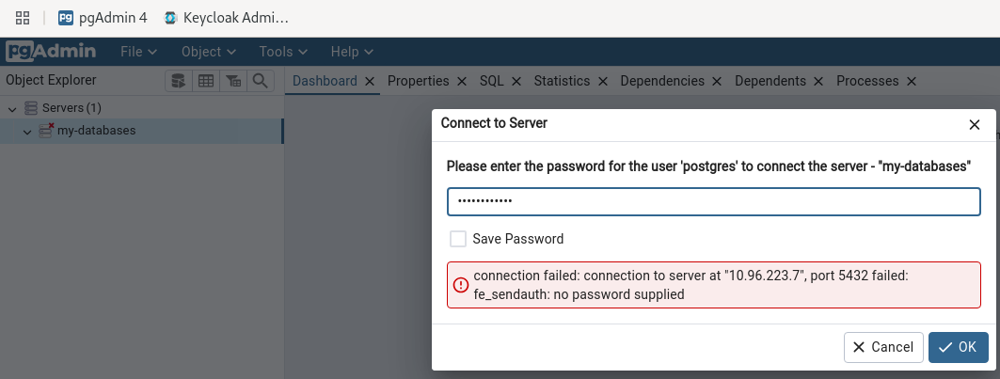
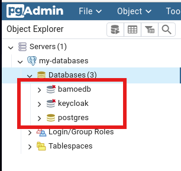
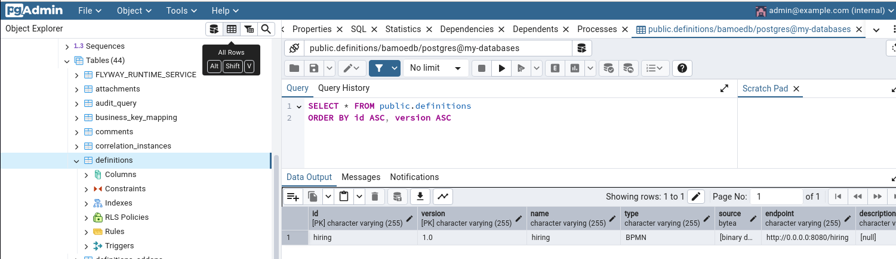
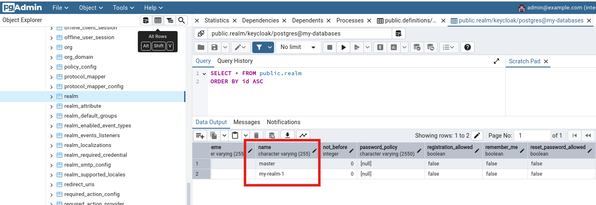
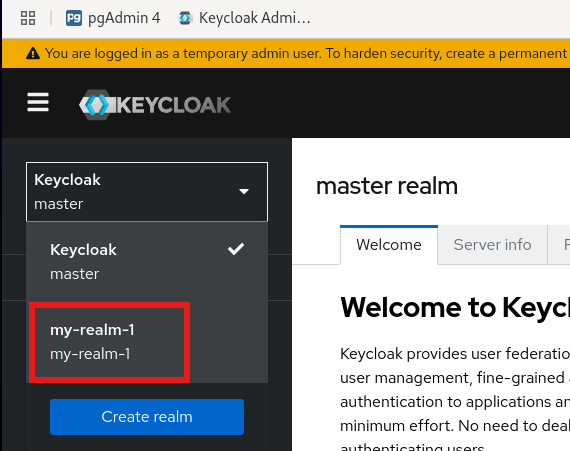
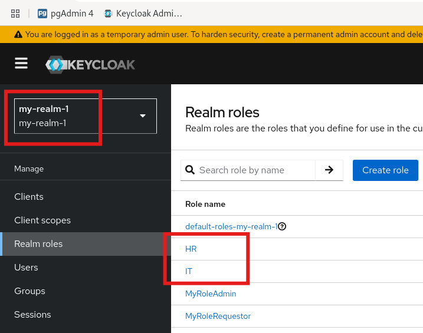

# bamoe9-k8s

## Introduction

This repository contains an example of a 'complete deployment' in a Kubernetes environment for an application based on a BPMN process in IBM BAMOE runtime version 9.1.1 (technical preview for long running processes supported by a database), the application is based on Quarkus technology.

The contents of this repository must be understood as an example of architecture and functional integration in a Kubernetes environment; they are not suitable for reuse in production environments.
As you can see, security enforcements are practically absent or minimal and present (user roles enforcement) for demonstration purposes only.

Minikube environment has been selected as a deployment target environment to demonstrate the simplicity of setup even on the developer's desktop.


## Scenario

The use case involves the use of a simple application based on a BPMN process implemented with two human tasks profiled for two different organizational roles.

Users who interact with the application must be authenticated and provide in each interaction with the application a set of credentials identified by a JWT token obtained through a login operation to an OIDC server (in this scenario Keycloak).

Keycloak has been configured with a customized realm for which two user groups have been created, one for Human Resources users, the other for Information Technology users; two roles 'HR' and 'IT' have been created to which the two user groups have been associated. What is defined as 'Realm Role' in Keycloak corresponds to the configuration in the 'Group' section of the human tasks.

With this configuration the human tasks of the process will be visible and usable only by users profiled for the role associated with the human task.

The database server supporting the solution is set up for two databases, one to support the BAMOE process runtime, the other to support the Keycloak server.

To create effective security enforcement, the BPM application was protected with a specific http policy.

A simple application was created that stands between the client and the BPM process application and that implements authentication and authorization enforcement based on JWT tokens; this application dynamically extracts the roles associated with the user from the JWT token and readjusts the call to the BPM application that can only be reached on address 127.0.0.1 within the execution pod; in this way the frontend container protects the backend application by appropriately implementing the 'Sidecar' pattern.

The frontend application also implements authorization logic that is not present in the standard BPMN notation such as which roles can start new process instances.

The frontend application is intended to be an example from which to take inspiration and create your own access security policies for BPMN applications created with Kogito technology (current version in the 'incubator' phase, https://github.com/orgs/apache/repositories?q=kogito), in this case on IBM BAMOE distribution version 9.1.1


## Systems used

A 'complete deployment' is a set of components such as:
1. Postgresql database
2. PGAdmin for database administration
3. Keycloak for SSO security management with JWT token
4. BAMOE in Compact architecture

## Applications used

The source code repo for BPM application https://github.com/marcoantonioni/bamoe9-oidc-processes

Of course I invite you to make a clone and modify everything to your needs.

## Containers and registries

Containers ready to use can be pulled from my quay.io account

https://quay.io/repository/marco_antonioni/bamoe9-compact-architecture-security
https://quay.io/repository/marco_antonioni/bamoe9-process-jwt-security


## Target environment for deployment

As mentioned above I chose Minikube (https://minikube.sigs.k8s.io/docs/) because it is a solid K8S environment and well known by many. 

The CRs that you will find in this repository are generic and can be deployed in any K8S and Openshift runtime, obviously also Openshift Local (https://developers.redhat.com/products/openshift-local/overview).


## CR configuration

In the 'k8s-CRs' folder there are all the CRs in yaml format ready to be deployed in the 'bamoe-k8s' namespace; modify them as you like.

In the 'configuration/configuration-steps.md' file you will find a series of snippets for the creation of the various CRs starting from a series of environment variables defined in the 'env.properties' file.

The log level for BAMOE applications are at 'INFO' level in 'QUARKUS_LOG_LEVEL' enviroment variables for each containers; change it to 'TRACE' if needed.

<b>Warning</b>:
<mark>
Authentication and verification of the validity of the JWT token require (frontend policy) among other things that the token has been created from a specific URL that has been configured in the environment variable of the frontend container (QUARKUS_OIDC_AUTH_SERVER_URL and QUARKUS_OIDC_CLIENT_AUTH_SERVER_URL).
In order to be authorized you will have to configure (even simply on the '/etc/hosts' file) an entry with the name 'minikube' and the IP address of your Minikube runtime. To obtain the IP of the Minikube instance, execute the command 'minikube ip'.
The same goes for the port number assigned to the 'nodePort' of the various 'Service'; adapt them according to your needs.
</mark>

## CR Deployment / Undeployment

The shell scripts 'deploy-all-resources.sh' and 'undeploy-all-resources.sh' are available to automate the deployment of the scenario.

The deployment involves the use of a single namespace within which the various components will operate.

The networking addressing between the various components uses only the name of the relative 'Service' and therefore is resolved within the namespace subnet.


## Verifications

After the deployment of the various components you can do some basic checks.

Don't be alarmed if some pod will report one or more restarts, it will probably be due to the Postgres database setup delay times.

<b>1 Check the Postgres setup and the 'keycloak' and 'bamoe' databases</b>

1.1 Login to the PGAdmin console with username 'admin@example.com' and password 'admin'
 http://minikube:45200/

1.2 Expand the 'Servers' group and enter password 'myPgPassword'



1.3 Check presence of databases

Expand 'Databases', 'bamoedb' and 'keycloak' must be listed.


1.4 Check the presence of 'bamoedb' database tables

Expand databases/<b>bamoedb</b>/schemas/public/tables 

Select table 'DEFINITIONS'

Execute 'all-rows' command and check for the presence of 'HIRING' process (see NAME and ID columns)



1.5 Check the presence of 'keycloak' database tables

Expand databases/<b>keycloak</b>/schemas/public/tables

Select table 'REALMS'

Execute 'all-rows' command and scroll right to the '<b>NAME</b>' column, check for the presence of 'MY-REALM-1'




<b>2 Check the custom realm configuration in Keycloak</b>

2.1 Login to the Keycloak console with username 'admin' and password 'admin'

 http://minikube:45201/admin/master/console/

2.2 Select realm 'my-realm-1'



2.3 Select Realm Roles and verifiy the presence of '<b>HR</b>' and '<b>IT</b>' roles




## Run Process Instances

To start a process instance, perform the following two steps (change host/port as needed for your environment)

1. Login to the Keycloak server (JWT token)
```
KC_HOST=minikube
USER_NAME=alice
USER_PWD=alice

KC_PORT=45201
KC_REALM=my-realm-1
KC_CLIENT_USER=my-client-bpm
KC_CLIENT_SECRET=my-secret-bpm
KC_TOKEN_EXPIRATION=""
KC_TOKEN_SCOPE=""

KC_FULL_TOKEN=$(curl -sk -X POST http://${KC_HOST}:${KC_PORT}/realms/${KC_REALM}/protocol/openid-connect/token \
  --user ${KC_CLIENT_USER}:${KC_CLIENT_SECRET} -H 'content-type: application/x-www-form-urlencoded' \
  -d 'username='${USER_NAME}'&password='${USER_PWD}'&grant_type=password&scope=openid')

if ([[ ! -z "${KC_FULL_TOKEN}" ]] && [[ "${KC_FULL_TOKEN}" != "null" ]]) then echo "Logged in"; else echo "Not logged in"; fi
if ([[ ! -z "${KC_FULL_TOKEN}" ]] && [[ "${KC_FULL_TOKEN}" != "null" ]]) then KC_TOKEN=$(echo "${KC_FULL_TOKEN}" | jq '.access_token' | sed 's/"//g'); else KC_TOKEN=""; fi
if ([[ ! -z "${KC_FULL_TOKEN}" ]] && [[ "${KC_FULL_TOKEN}" != "null" ]]) then KC_TOKEN_EXPIRATION=$(echo $KC_FULL_TOKEN | jq .expires_in | sed 's/"//g'); fi
if ([[ ! -z "${KC_FULL_TOKEN}" ]] && [[ "${KC_FULL_TOKEN}" != "null" ]]) then KC_TOKEN_SCOPE=$(echo $KC_FULL_TOKEN | jq .scope | sed 's/"//g'); fi

echo "Token expires in: ${KC_TOKEN_EXPIRATION}"
echo "Token scopes: ${KC_TOKEN_SCOPE}"
```


2. Start a process instance
```
_BAMOE_FRONTEND_HOST=${KC_HOST}
_BAMOE_FRONTEND_PORT=45202
_PROCESS_NAME=hiring
curl -v -H "Content-Type: application/json" -H "Accept: application/json" -H "Authorization: Bearer "${KC_TOKEN} \
  -X POST http://${_BAMOE_FRONTEND_HOST}:${_BAMOE_FRONTEND_PORT}/bamoe/process-instances/${_PROCESS_NAME} \
    -d '{"candidateData": { "name": "Jon", "lastName": "Snow", "email": "jon@snow.org", "experience": 5, "skills": ["Java", "Kogito", "Fencing"]}}' | jq .
```

the result will be similar to
```
< HTTP/1.1 200 OK
< content-length: 108
< Content-Type: application/json;charset=UTF-8
< 
{ [108 bytes data]
100   246  100   108  100   138     74     95  0:00:01  0:00:01 --:--:--   169
* Connection #0 to host minikube left intact
{
  "id": "81ced7e1-ffc2-4784-bd2f-fafe75e24650",
  "offer": {
    "category": "Senior Software Engineer",
    "salary": 40450
  }
}
```


To complete the process with human tasks, adapt the 'curl' command examples found in the repository from the section https://github.com/marcoantonioni/bamoe9-oidc-processes#3-get-a-list-of-process-instances and following steps.


## Conclusions

TBD...

## References

<a href="https://www.ibm.com/docs/en/ibamoe/9.1.x" target="_blank">IBM BAMOE v9.1 Docs</a>

<a href="https://www.ibm.com/docs/en/ibamoe/9.1.x?topic=services-components-process-service" target="_blank">IBM BAMOE v9.1 Compact Architecture</a>

<a href="https://ibm.biz/bamoe-developer-program" target="_blank">IBM BAMOE Developer Program</a>


